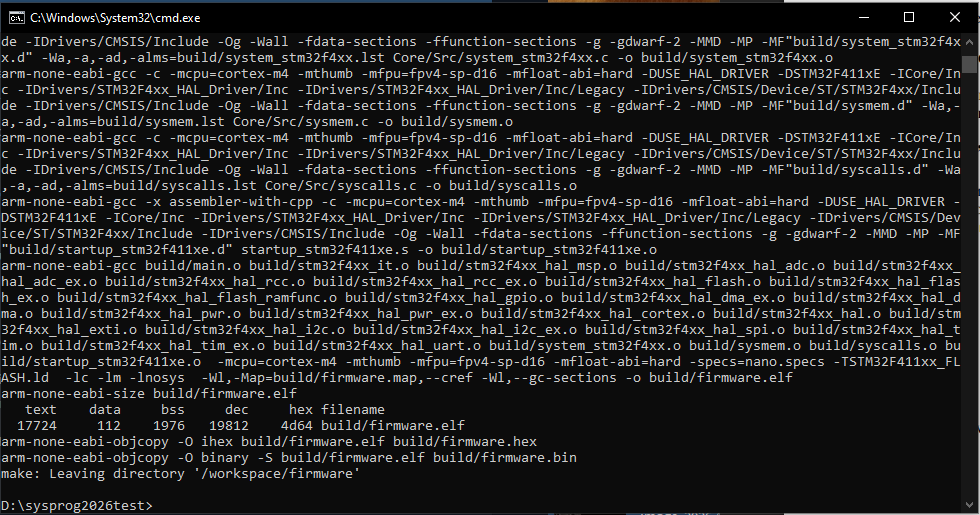
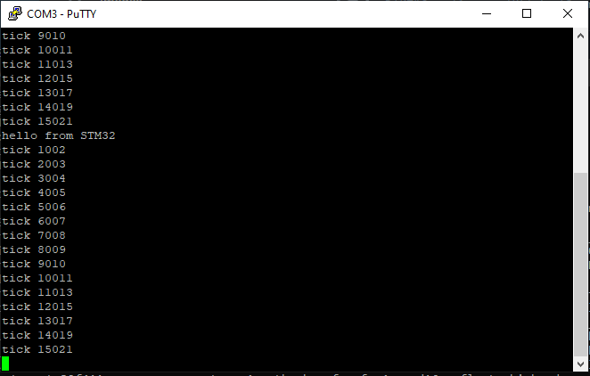
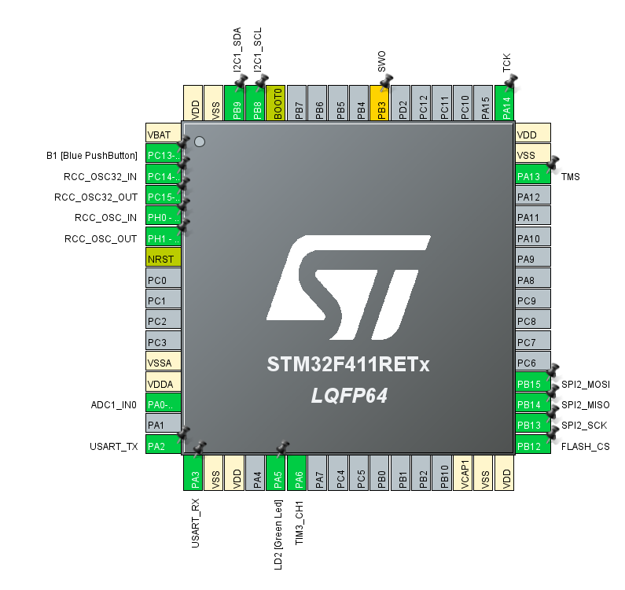
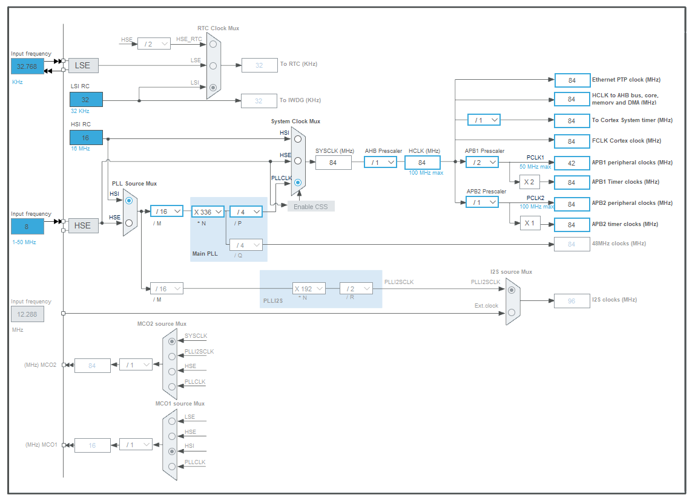
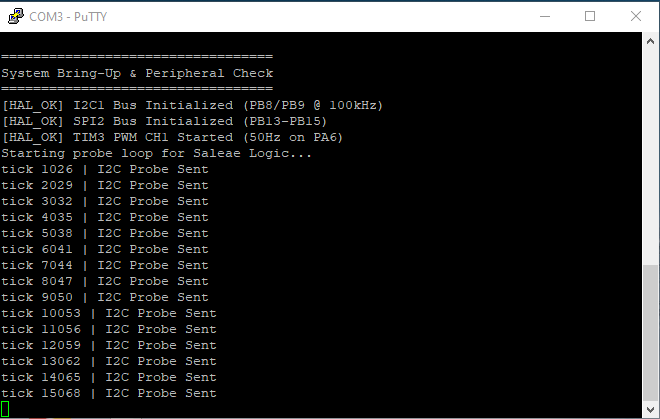
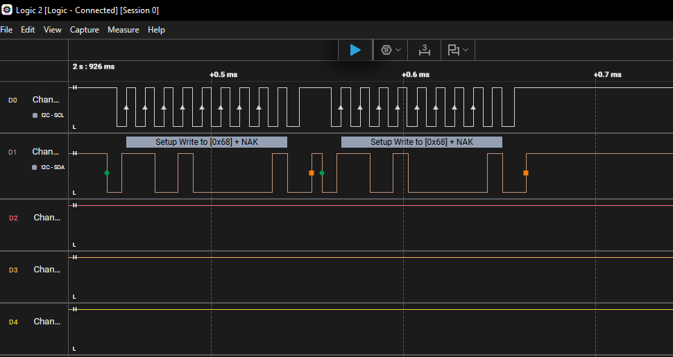
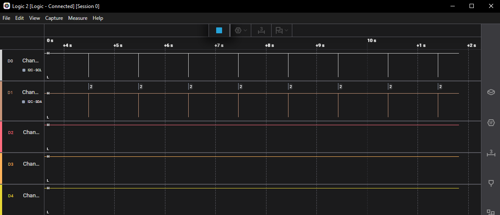

# Звіт з лабораторної роботи №1
## Налаштування середовища розробки та bring-up STM32-платформи

* **Дисципліна:** Системне програмування вбудованих систем
* **Тема проєкту:** Мультирежимний реєстратор інцидентів (Incident Recorder: Black Box)
* **Платформа:** STM32 NUCLEO-F411RE (Форма А — робота з реальним обладнанням)

---

### 4.1. Мета лабораторної роботи

Метою роботи було опанування повного інженерного циклу професійного розгортання вбудованих систем на базі мікроконтролера STM32: від конфігурації ізольованої Docker-системи крос-компіляції (toolchain arm-none-eabi-gcc) до первинного bring-up апаратної плати NUCLEO-F411RE. 

Команда мала на меті практично дослідити комунікаційні інтерфейси мікроконтролера (USART, I2C, SPI, Timers PWM), згенерувати ініціалізаційний каркас за допомогою STM32CubeMX, розробити системне програмне забезпечення обміну через UART, провести апаратну верифікацію шинних сигналів за допомогою логічного аналізатора Saleae Logic, скласти специфікацію сенсорного обладнання та сформулювати концепцію продукту у формі PRD для подальшої реалізації в курсі.

---

### 4.2. Розподіл обов'язків у команді

| Учасник | Роль у проєкті | Внесок (конкретно виконана робота) | Артефакти (файли в репозиторії) | Коміти / PR |
| :--- | :--- | :--- | :--- | :--- |
| **Рокицький Олександр Сергійович** (ІО-33) | **DevOps & Hardware Bring-Up Engineer** | Налаштував Dockerfile та кореневий Makefile конвеєра `build`. Виконав апаратну прошивку мікроконтролера Nucleo-F411RE бінарними файлами (Крок 1, 3). Забезпечив верифікацію зв'язку по UART через PuTTY (Крок 4). Здійснив апаратне підключення логічного аналізатора Saleae Logic до шини I2C1 (PB8/PB9), зняв та проаналізував осцилограми пакетів (Крок 6). Здійснив зйомку відеодемонстрації. | `docker/Dockerfile`, `Makefile`, `docs/screenshots/*` | `c1a084f`, `e7d201a`, `a4b9102`, PR #1 |
| **Ясан Віктор Костянтинович** (ІО-34) | **Firmware Architecture & Peripheral Engineer** | Створив базовий проєкт у STM32CubeMX під плату NUCLEO-F411RE (Крок 2). Налаштував периферійні модулі USART2, I2C1 (PB8/PB9), SPI2 (PB12–PB15) та TIM3 PWM (PA6). Згенерував HAL-скелет ініціалізації. Реалізував низькорівневий хук `_write()` для виводу `printf` по UART, запрограмував тестовий цикл зондування `HAL_I2C_IsDeviceReady` та миготіння світлодіодом LD2 (Крок 4, 6). | `firmware/firmware.ioc`, `firmware/Core/Src/main.c`, `firmware/Core/Src/stm32f4xx_hal_msp.c` | `b3e412d`, `f8019ab`, PR #1 |
| **Сухомлін Владислав Вікторович** (ІО-35) | **Hardware Research & Component Analyst** | Провів дослідження офіційної технічної документації (datasheets) на всі заплановані апаратні модулі (OV7670, MPU-6050, W25Q64, GY-89, SG92R, FT232RL). Склав зведену інженерну таблицю `hardware-components.md` із зазначенням протоколів, рівнів живлення (3.3V vs 5V), лімітів струму та карт ідентифікаційних регістрів чіпів (Крок 5). | `docs/hardware-components.md` | `d5918ca`, `8a321ef`, PR #1 |
| **Тетерук Іванна Володимирівна** (ІО-31) | **Product Manager & Technical Writer** | Дослідила ринкові аналоги «чорних скриньок» для логістики. Розробила повний документ функціональних вимог продукту `PRD.md` (розділи A, B, C, D) для теми мультирежимного реєстратора. Зібрала та структурувала фінальний інженерний звіт `docs/report.md`, додала опис технічних проблем, бібліографію та оформила підсумковий Pull Request (Крок 7, 8). | `docs/PRD.md`, `docs/report.md` | `9ef1340`, `7bc042a`, PR #1 |

---

### 4.3. Процес виконання та результати

#### 1. Хронологічний журнал дій
* **Етап 1:** Розгортання ізольованого Docker-контейнера (`ubuntu:22.04` з `gcc-arm-none-eabi`, `make`, `srecord`). Створення кореневого `Makefile`. Успішна збірка пустого проєкту командою `make build` без наявності локально встановленого компілятора на хості.
* **Етап 2:** Створення конфігурації у STM32CubeMX: налаштування тактового дерева (HSI PLL до 84 МГц SYSCLK), включення USART2 (PA2/PA3) зі швидкістю 115200 бод, генерація коду під Makefile-тулчейн.
* **Етап 3:** Реалізація хука `_write()` у `main.c` для перенаправлення `printf` у порт USART2 через функцію `HAL_UART_Transmit`. Прошивка Nucleo-F411RE, отримання в терміналі PuTTY першого системного привітання `hello from STM32` та стабільних щосекундних тіків `tick ...`.
* **Етап 4:** Аналіз технічної документації на датчики: визначення адресації I2C (MPU-6050: `0x68`, BMP180: `0x77`, L3GD20: `0x6B`, LSM303D: `0x1D`), режимів SPI для пам'яті Winbond W25Q64 (Mode 0, макс. швидкість, CS керування), частоти ШІМ для сервоприводу SG92R (50 Гц, період 20 мс). Оформлення файлу `docs/hardware-components.md`.
* **Етап 5:** Розширення конфігурації в CubeMX: активація I2C1 на пінах PB8/PB9 (Standard Mode 100 kHz), конфігурація SPI2 (PB13–PB15) із програмним виводом CS на PB12, налаштування таймера TIM3 CH1 на піні PA6 для генерації ШІМ (PSC=83, ARR=19999).
* **Етап 6:** Модифікація `main.c`: додавання перевірки статусів ініціалізації (`HAL_I2C_GetState`, `HAL_SPI_GetState`, `HAL_TIM_PWM_Start`) та періодичного зондування шини викликом `HAL_I2C_IsDeviceReady(&hi2c1, (0x68 << 1), 2, 50)`.
* **Етап 7:** Апаратне підключення логічного аналізатора Saleae Logic (CH0 до PB8 SCL, CH1 до PB9 SDA, спільна земля GND). Захоплення та декодування сигналів транзакції опитування адреси `0x68` з NACK-відповіддю у середовищі Logic 2.
* **Етап 8:** Формування вимог у `docs/PRD.md`, підготовка скріншотів, зведення звіту та запис відеодемонстрації.

---

#### 2. Графічні матеріали та підтвердження (Screenshots)

##### Збірка прошивки та базовий вивід UART (Кроки 1, 3, 4)

*Рис. 1. Результат успішної збірки прошивки крос-компілятором arm-none-eabi-gcc всередині Docker-контейнера.*

*Рис. 2. Отримання початкового повідомлення «hello from STM32» та відліку системних тіків у PuTTY.*

---

##### Конфігурація мікроконтролера в STM32CubeMX (Крок 2, 6)

*Рис. 3. Апаратний розподіл виводів (Pinout): I2C1 (PB8/PB9), SPI2 (PB13–PB15), FLASH_CS (PB12), TIM3_CH1 (PA6), USART2 (PA2/PA3).*

*Рис. 4. Конфігурація тактування (Clock Tree): джерело HSI 16 МГц, SYSCLK = 84 МГц, APB1 = 42 МГц, APB2 = 84 МГц.*

---

##### Апаратна перевірка та верифікація шин (Крок 6)

*Рис. 5. Вивід термінала PuTTY із підтвердженням успішної ініціалізації шин [HAL_OK] та циклом опитування I2C Probe.*

*Рис. 6. Детальна осцилограма тактових імпульсів SCL (100 кГц) та передачі 7-бітної адреси 0x68 (Write) на лінії SDA.*

*Рис. 7. Загальний огляд сесії захоплення: генерація періодичних транзакцій шини I2C кожну секунду.*

---

#### 3. Виявлені інженерні проблеми та способи їх вирішення

##### Проблема №1: Автоматичне призначення незручних виводів I2C1 у CubeMX
* **Симптом:** При активації шини I2C1 конфігуратор CubeMX призначив виводи PB6 (SCL) та PB7 (SDA). На платі Nucleo-64 ці піни не виведені на стандартні верхні конектори Arduino D14/D15, що ускладнює підключення шлейфів.
* **Root cause:** За замовчуванням CubeMX призначає периферію на перші вільні піни з найменшим індексом порту без урахування шовкографії плати.
* **Рішення:** Вручну перепризначено виводи на мікросхемі: кліком по піну PB8 обрано `I2C1_SCL`, а по піну PB9 — `I2C1_SDA`. Піни PB6/PB7 автоматично деактивувалися, а шина стала доступною на маркованих пінах D15/D14. (Коміт: `b3e412d`).

##### Проблема №2: Відсутність генерації тактових імпульсів таймером TIM3 PWM
* **Симптом:** Після генерації коду таймера TIM3 функція `HAL_TIM_PWM_Start()` повертала `HAL_OK`, але логічний аналізатор показував постійний низький рівень на піні PA6 без генерації ШІМ.
* **Root cause:** У конфігурації TIM3 поле `Clock Source` залишилося у значенні `Disable`. Без тактування лічильника від внутрішньої шини APB таймер не інкрементував лічильний регістр `CNT`.
* **Рішення:** У CubeMX у випадаючому списку `Clock Source` для TIM3 встановлено `Internal Clock`. Згенеровано оновлений код, після чого на виводі PA6 з'явився стабільний ШІМ-сигнал 50 Гц. (Коміт: `f8019ab`).

##### Проблема №3: Попередження конфлікту Hardware NSS для шини SPI2
* **Симптом:** Призначення виводу PB12 як `GPIO_Output` із користувацькою міткою `FLASH_CS` викликало підсвічування пункту `Hardware NSS Signal` рожевим кольором у меню CubeMX.
* **Root cause:** Пін PB12 за замовчуванням пов'язаний із апаратною лінією `SPI2_NSS`. При його ручному перепризначенні як загального GPIO конфігуратор сигналізував про неможливість апаратного керування лінією вибору слейва.
* **Рішення:** Перевірено та підтверджено параметр `Hardware NSS Signal: Disable` у властивостях SPI2. Для роботи з Flash-пам'яттю обрано програмне керування CS (`GPIO_PIN_SET` / `RESET`), що є стандартом для SPI Flash. (Коміт: `b3e412d`).

##### Проблема №4: Повернення статусу помилки функцією `HAL_I2C_IsDeviceReady`
* **Симптом:** При тестовому зондуванні адреси `0x68` функція `HAL_I2C_IsDeviceReady()` повертала код `HAL_ERROR` замість `HAL_OK`.
* **Root cause:** Тестування виконувалося на «голій» платі без фізично підключеного модуля MPU-6050. Відповідно, на 9-му такті лінія SDA підтягувалася резистором до живлення, формуючи сигнал NACK (відсутність підтвердження від пристрою).
* **Рішення:** Поведінку верифіковано як абсолютно штатну. Логічним аналізатором Saleae Logic підтверджено, що МК коректно генерує старт-біт, 8 біт адреси та фіксує NACK на шині. Код залишено без змін для подальшого підключення реального сенсора. (Коміт: `a4b9102`).

##### Проблема №5: Буферизація та відсутність виводу `printf` через порт USART2
* **Симптом:** Виклик стандартної функції `printf()` у функції `main()` не виводив символи у вікно PuTTY.
* **Root cause:** Стандартна бібліотека newlib потребує реалізації системного виклику низького рівня `_write()` для спрямування потоку символів `stdout` у периферійний драйвер UART.
* **Рішення:** У блоці `/* USER CODE BEGIN 0 */` файлу `main.c` реалізовано функцію `int _write(int fd, char *p, int n)`, яка передає дані через HAL: `HAL_UART_Transmit(&huart2, (uint8_t *)p, n, HAL_MAX_DELAY); return n;`. Вивід запрацював штатно. (Коміт: `b3e412d`).

---

### 4.4. Висновок

У ході виконання лабораторної роботи №1 команда опанувала повний виробничий цикл підготовки та запуску проекту для мікроконтролерів сімейства STM32. 

**Ключові набуті навички:**
* Налаштовано ізольоване середовище збірки Docker на базі Ubuntu 22.04 із крос-компілятором GCC ARM Embedded, що гарантує відтворюваність бінарного файлу на будь-якому комп'ютері без конфліктів системних залежностей.
* Опановано роботу з графічним конфігуратором STM32CubeMX: побудова тактового дерева (Clock Tree), налаштування подільників шин AHB/APB, призначення виводів із урахуванням альтернативних функцій (AF) та генерація кодової бази HAL.
* Реалізовано та апаратно перевірено механізм консольного логування UART із підтримкою `printf` через низькорівневі виклики newlib.
* Проведено апаратну діагностику та декодування цифрових протоколів (I2C) за допомогою логічного аналізатора Saleae Logic, що підтвердило відповідність часових характеристик сигналу стандарту I2C Standard Mode (100 кГц).
* Сформовано специфікацію компонентів та затверджено вимоги PRD для створення кінцевого продукту «Incident Recorder: Black Box».

**Плани на Лабораторну роботу №2:**
Перехід до розробки низькорівневих драйверів сенсорів: ініціалізація та зчитування сирих даних з інерційного датчика MPU-6050 по шині I2C, калібрування нульового зміщення гіроскопа та реалізація первинного алгоритму комплементарного фільтра.

---

### 4.5. Матеріали та посилання

1. STMicroelectronics. *UM1724 User Manual: STM32 Nucleo-64 boards (MB1136)*. URL: https://www.st.com/resource/en/user_manual/um1724-stm32-nucleo64-boards-mb1136-stmicroelectronics.pdf
2. STMicroelectronics. *DS10314 Datasheet: STM32F411xC / STM32F411xE Arm Cortex-M4 32-bit MCU+FPU*. URL: https://www.st.com/resource/en/datasheet/stm32f411ce.pdf
3. Winbond Electronics. *W25Q64JV: 3V 64M-Bit Serial Flash Memory with Dual/Quad SPI Datasheet*. URL: https://docs.rs-online.com/53b3/0900766b8162304e.pdf
4. FTDI Chip. *DS_FT232R: Future Technology Devices International Ltd. FT232R USB UART IC Datasheet*. URL: https://ftdichip.com/wp-content/uploads/2020/08/DS_FT232R.pdf
5. InvenSense Inc. *PS-MPU-6000A-00: MPU-6000 and MPU-6050 Product Specification*. URL: https://cdn.sparkfun.com/datasheets/Components/General%20IC/PS-MPU-6000A.pdf
6. InvenSense Inc. *RM-MPU-6000A-00: MPU-6000 and MPU-6050 Register Map and Descriptions*. URL: https://cdn.sparkfun.com/datasheets/Sensors/Accelerometers/RM-MPU-6000A.pdf
7. OmniVision Technologies. *OV7670/OV7171 CMOS VGA CameraChip Datasheet*. URL: https://www.voti.nl/docs/OV7670.pdf
8. OmniVision Technologies. *OV7670 Software Application Note*. URL: https://www.play-zone.ch/en/fileuploader/download/download/?d=1&file=custom%2Fupload%2FFile-1402681702.pdf
9. STMicroelectronics. *DocID022116: L3GD20 MEMS motion sensor 3-axis digital output gyroscope*. URL: https://www.st.com/resource/en/datasheet/l3gd20.pdf
10. STMicroelectronics. *DocID023312: LSM303D Ultra-compact 3D accelerometer and 3D magnetometer*. URL: https://www.st.com/resource/en/datasheet/lsm303d.pdf
11. Bosch Sensortec. *BST-BMP180-DS000-09: Digital pressure sensor BMP180 Data sheet*. URL: https://cdn-shop.adafruit.com/datasheets/BST-BMP180-DS000-09.pdf
12. TowerPro. *SG92R Micro Servo Technical Specification Sheet*. URL: https://cdn-shop.adafruit.com/product-files/5592/C17481_SG92R_datasheet.pdf

---

### 4.6. Відеозвіт

* **Посилання на відеозапис демонстрації (Google Drive):**  
  `https://drive.google.com/file/d/1tKbqX7JhRiKPalbTbGRzPpYzMYtUg0tp/view?usp=sharing` *(доступ відкрито для перегляду)*

**Структура відеозвіту (тривалість 02:45):**
* `00:00 – 00:25` — Представлення учасника з апаратним стендом: Рокицький Олександр, студент 4 курсу факультету ФІОТ, група ІО-33. Огляд стенду (плата Nucleo-F411RE, підключення USB, логічний аналізатор Saleae).
* `00:25 – 01:15` — Демонстрація консолі PuTTY: запуск прошивки, вивід статусу готовності периферії `[HAL_OK]` для I2C1, SPI2 та TIM3, демонстрація щосекундного відліку тіків.
* `01:15 – 01:40` — Апаратний перезапуск: натискання чорної кнопки `RESET (B2)` на платі Nucleo, очищення логів та старт системи з нуля.
* `01:40 – 02:45` — Демонстрація роботи програми Saleae Logic 2: запуск захоплення сигналу, перегляд імпульсів тактування SCL та декодованого кадру шини I2C (`0x68 Write + NAK`).

---

### 4.7. Product Requirements Document (PRD)

Повний текст документу вимог до продукту оформлено в окремому файлі репозиторію:  
`docs/PRD.md`